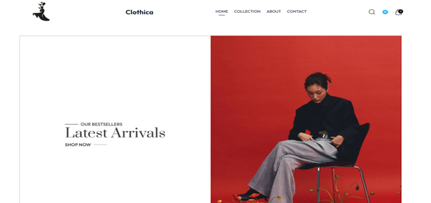
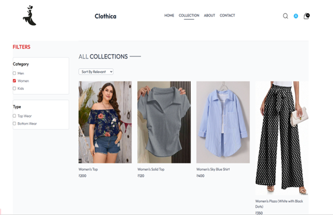
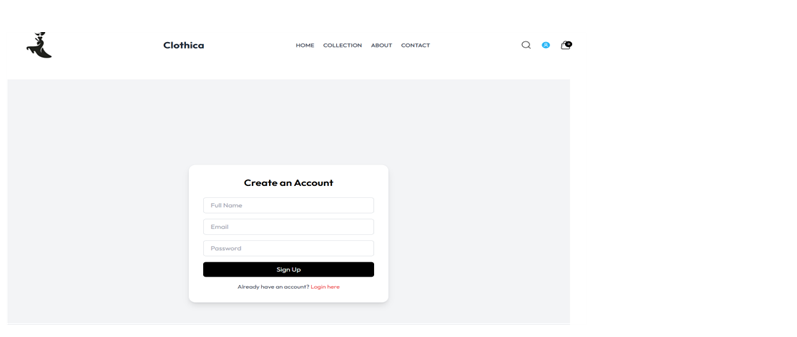
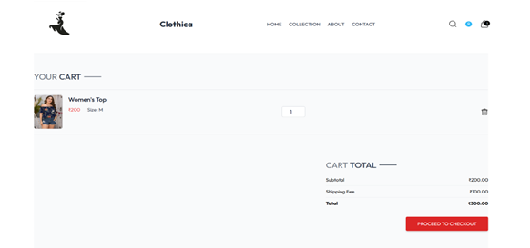
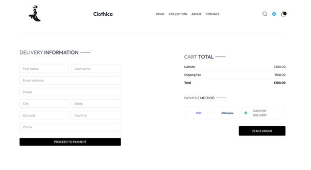
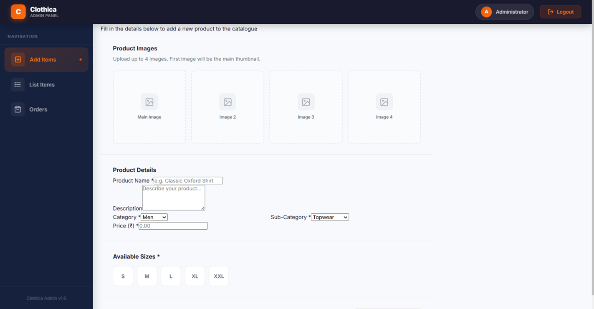
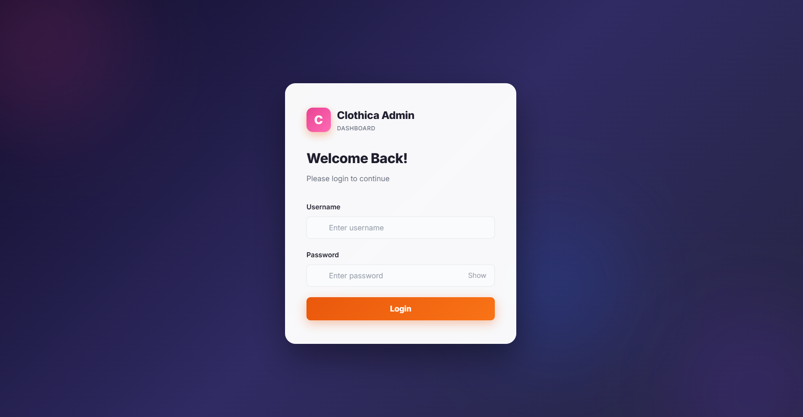

# Clothica E-Commerce Website

Full Stack E-Commerce Website built using:

- React.js
- Node.js
- Express.js
- MySQL

## Features
- User Authentication
- Admin Panel
- Product Management
- Cart System
- Order Placements

## Screenshots

### Homepage

### Collection

### Latest Collection

### User Login & Signup page

### Cart

### Delivery and Payment

### Admin Panel

### Admin Panel Login (only authorized admin can login)

## Tech Stack
Frontend: React.js
Backend: Node.js + Express
Database: MySQL
